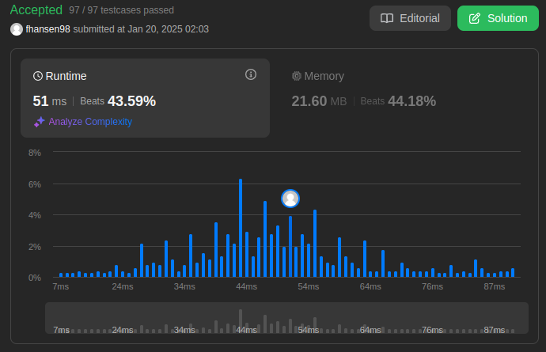
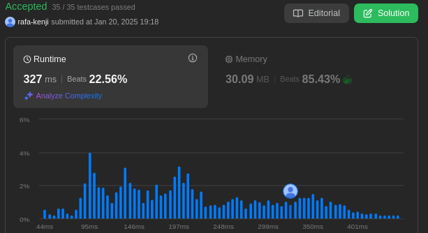
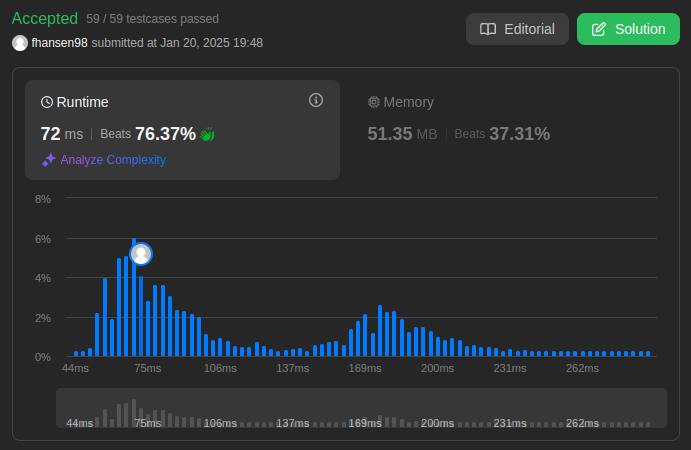

# Greed_LeetCode_Questoes

**Número da Lista**: 42 
**Conteúdo da Disciplina**: Algoritmos Ambiciosos  

## Alunos
|Matrícula | Aluno |
| -- | -- |
| 19/0044128  |  Rafael Kenji Taira |
| 22/2032810  |  Felipe Aguiar Hansen |

## Sobre 
Este projeto consiste em quatro códigos desenvolvidos para resolver questões específicas de códigos gulosos/ambiciosos(greed) da plataforma LeetCode. O objetivo é oferecer soluções para problemas de média e alta dificuldade em grafos, passando por problemas como encontrar o menor caminho, detectar ciclos e calcular a conectividade de nós. Cada código utiliza a linguagem Python para resolver o problema específico, aproveitando estruturas de dados otimizadas para garantir desempenho e clareza.

**Problemas**
|Código | Título | Dificuldade |
| -- | -- | -- |
| [630](https://leetcode.com/problems/course-schedule-iii/description/) | Course Schedule III | Difícil |
| [1235](https://leetcode.com/problems/maximum-profit-in-job-scheduling/description/) | Maximum Profit in Job Scheduling | Difícil |
| [435](https://leetcode.com/problems/non-overlapping-intervals/description//) | Non-overlapping Intervals | Médio |

## Screenshots
- Questão 630

- Questão 1235

- Questão 435

## Uso 
**Linguagem**: Python 
Para verificar as resoluções das questões, copie a resolução da questão desejada que está dentro de sua respectiva pasta e cole na página de exercício do leetcode que tenha a questão ou no código na seção dos problemas apresentados anteriormente

## Video 

### Questão Difícil 630: [Course Schedule III](https://youtu.be/y7eVGDXdaGQ)

### Questão Dificil 1235: [Maximum Profit in Job Scheduling](https://youtu.be/VJRGrez36e8)

### Questão Difícil 435: [Non-overlapping Intervals](https://youtu.be/fVcP3dELS1Q)

